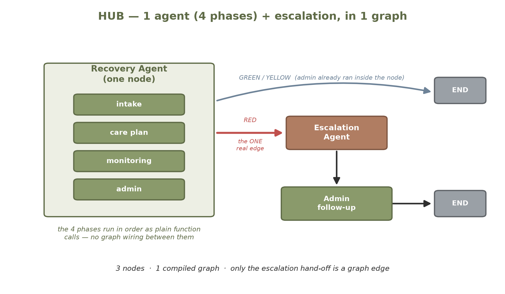

# Hub
### What does a multi-agent architecture actually cost? A measured redesign of Nexus.

[](https://github.com/raghavanlakshmi/hub/actions/workflows/tests.yml)


Hub is a deliberately minimal redesign of [Nexus](https://github.com/raghavanlakshmi/nexus), a post-hospital
recovery co-pilot. It answers one question with running code instead of theory:

> If you collapse Nexus's five agents into one and keep **only** the boundary that matters — the gate in
> front of Escalation — what changes in quality, cost, latency and complexity?

Same tools, same prompts, same model, same UI. Only the orchestration differs.

## Results

Measured on a 30-case hand-labelled golden dataset
([full evaluation](https://github.com/raghavanlakshmi/nexus-hub-eval)):

| Metric | Nexus (5 agents) | Hub v1 (1 agent + escalation) | Hub v2 (+ escalation fix) |
|---|---|---|---|
| Check-in classification accuracy | 96.7% | 96.7% | **100%** |
| Escalation-tier accuracy | 93.3% | 90.0% | **96.7%** |
| RED emergencies caught | 5/5 | 5/5 | 5/5 |
| Care-plan faithfulness (LLM judge) | 0.97 | 0.96 | 0.96 |
| Mean check-in cost | $0.0048 | $0.0049 | $0.0053 |
| Graph nodes / compiled graphs / orchestration LOC | 5 / 2 / 56 | 3 / 1 / 41 | 3 / 1 / 41 |

- **Collapsing the agents cost nothing measurable.** Quality and cost are flat — the differences are
  LLM sampling noise, since the prompts are byte-identical — while graph nodes drop from 5 to 3 and
  orchestration code by about a quarter.
  The four removed boundaries were a sequential pipeline over one patient, not independent specialists.
- **What it trades away:** per-stage observability. Nexus's separate nodes make it slightly easier to
  see which stage a bug lives in.
- **The real risk was elsewhere.** The evaluation surfaced keyword-based escalation as the dominant
  safety failure in *both* systems, which Hub v2 fixes (below).

## Architecture

| Nexus | Hub |
|---|---|
|  |  |

Only one hand-off is a genuine judgment call that can trigger a real-world action (an SMS, a 911
screen): the gate into **Escalation**. Hub keeps that as a real graph edge and folds intake, care plan,
monitoring and admin into one **Recovery Agent** that branches internally on `state["phase"]`.

- `agents/recovery_agent.py` — the consolidated agent, one public function `run_recovery_agent()`
- `agents/escalation_agent.py` — the preserved boundary, plus the v2 tiering logic
- `agents/orchestrator.py` — one LangGraph graph, three nodes
- `instrumentation/usage_tracker.py` — wraps every Claude call and logs tokens, cost and latency, so the
  comparison uses measured numbers, not estimates

Tools, state schema, system prompts and the Streamlit UI are copied from Nexus **on purpose**: keeping
them identical means any measured difference comes from orchestration alone. That is why
`ui/streamlit_app.py` is nearly the same file in both repos.

## Hub v2 — fixing the escalation tier

The evaluation's dominant failure: paraphrased emergencies ("I feel like I'm suffocating", "an elephant
on my chest") slipped past the literal keyword list and were under-tiered. Hub v2 adds three changes,
opt-in via `HUB_V2=1` so the default behaviour matches Nexus:

1. **Two-layer tiering** — the keyword check stays as a deterministic floor, an LLM triage call judges
   meaning, and the *more urgent* answer wins. The LLM can raise a tier but never lower it, so a timeout
   or bad response can't downgrade a real emergency.
2. **Trend floor** — two or more consecutive YELLOW days before a RED lift the tier to at least TIER_2.
3. **Breathlessness guardrail** — a GREEN check-in with non-negated shortness-of-breath language is
   floored at YELLOW.

Result: escalation-tier accuracy 90.0% → 96.7%, RED tier exactly right 3/5 → 4/5, and **no unsafe
under-escalations** — the one remaining miss over-escalates a borderline case. Added cost: one Claude
call (~$0.0027), only on RED check-ins.

These guarantees are pinned down in tests: `tests/test_escalation_tier.py` checks that v1 misses the
paraphrases, that the LLM layer can raise but never lower a tier, that an LLM failure falls back to the
keyword floor, and the trend floor; `tests/test_dyspnea_guardrail.py` covers negation handling.

## Run it

```bash
git clone https://github.com/raghavanlakshmi/hub.git
cd hub
python -m venv venv
source venv/bin/activate          # Windows: venv\Scripts\activate
pip install -r requirements.txt
cp .env.example .env              # add your keys
streamlit run ui/streamlit_app.py # HUB_V2=1 for the v2 escalation logic
```

Requires `ANTHROPIC_API_KEY` and a Pinecone index (1024 dimensions, cosine) named to match
`PINECONE_INDEX_NAME`. Twilio, Gmail, ElevenLabs and Nebius are optional. Voice check-in needs `ffmpeg`.
Demo discharge PDFs are in the [Nexus repo](https://github.com/raghavanlakshmi/nexus/tree/main/data).

```bash
pip install -r requirements-dev.txt
python -m pytest -q tests         # offline, no API keys needed
```

## Tech stack

LangGraph · Claude (`claude-sonnet-4-6`) · Nebius Token Factory (`Llama-3.3-70B-Instruct`) · Pinecone ·
Streamlit · PyMuPDF · OpenFDA · ElevenLabs speech-to-text · Twilio · Gmail SMTP · LangSmith · pytest

<details>
<summary><b>Single-run trace comparison (GREEN and RED check-ins)</b></summary>

One run each of the same discharge PDF (`01_chf_john_demo.pdf`) and check-in through both systems.

| GREEN run | Nexus | Hub |
|---|---|---|
| Claude calls | 3 | 3 |
| Input tokens | 2456 | 2454 |
| Output tokens | 3078 | 2761 |
| Cost | $0.0535 | $0.0488 |
| Latency | 45.8 s | 42.4 s |

| RED run | Nexus | Hub |
|---|---|---|
| Claude calls | 3 | 3 |
| Input tokens | 2473 | 2470 |
| Output tokens | 3004 | 2986 |
| Cost | $0.0525 | $0.0522 |
| Latency | 48.5 s | 48.5 s |

Input tokens — the part orchestration controls — match to within 3 tokens. The output and cost gaps
come almost entirely from one care-plan call where Claude happened to write a longer plan: noise, not
architecture. A RED check-in is still a single Claude call in both, so the escalation boundary is pure
routing with zero token cost.

The logs show the structural difference: Hub prints one `[Recovery Agent: …]` block and a single
crossing into `[Escalation Agent]`; Nexus prints a separate prefix at every stage.

```
[Recovery Agent: intake] PDF parsed. 2 pages, 1541 chars.
[usage] intake: 798 in / 785 out | $0.0142 | 8595ms
[Recovery Agent: careplan] Checking 4 medications via OpenFDA...
[usage] careplan: 1005 in / 1888 out | $0.0313 | 32605ms
[usage] monitoring: 667 in / 313 out | $0.0067 | 7264ms
[Recovery Agent: monitoring] Classification: RED
[Escalation Agent] RED flag detected. Determining tier...   ← the one graph edge
[Escalation Agent] Tier: TIER_3
```

</details>

## Safety & data

- Synthetic discharge data only. Not medical advice — in an emergency, call 911.
- Clinical content — provider messages and medication-conflict alerts — waits in a human approval queue.
  Sent automatically: appointment reminders and weekly summaries to the caregiver, and an SMS to the
  emergency contact on a Tier 2/3 escalation, only if the patient consented.

## License

[MIT](LICENSE)
